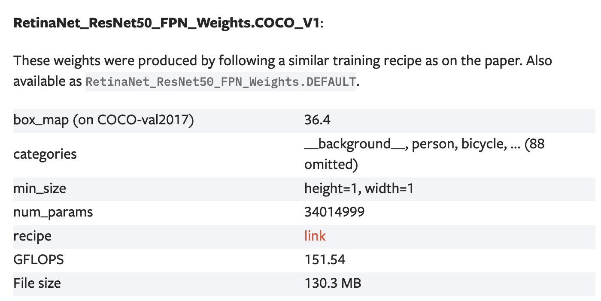
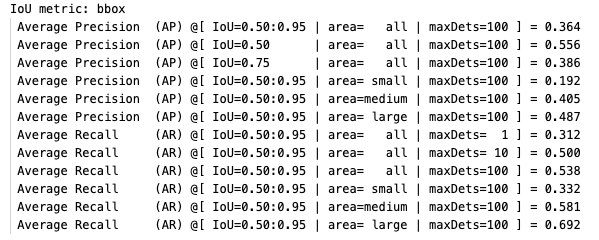
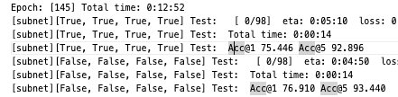
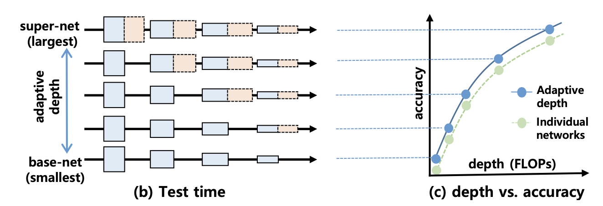
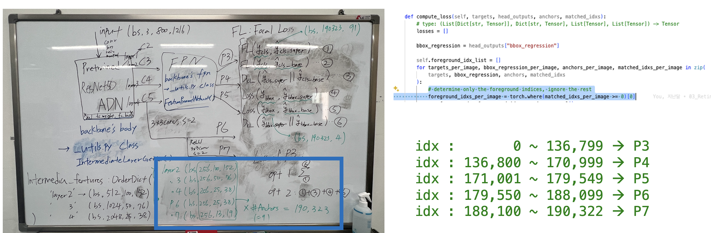
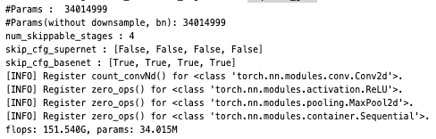
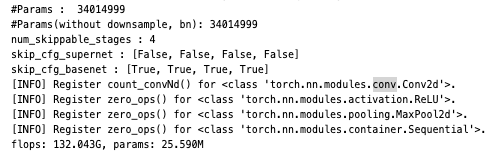
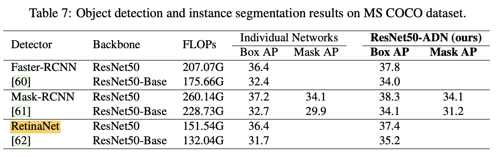

# INU_RISE

* This repository is dedicated to researching and developing efficient techniques for the object detection task.

</br>

# Requirements

* All experiments are conducted using identical hardware and software resources.
   * **HW** : 
     * **GPU** : NVIDIA GeForce RTX 4090 * 4
   * **SW** :
      * **Ubuntu** : 22.04
      * **python** : 3.11.7
      * **cuda** : 12.1
      * **pytorch** : 2.2.1

</br>

## Description of the Project
- The key papers that have influenced the topic selection are as follows.
   * [He, Kaiming, et al. "Deep residual learning for image recognition." Proceedings of the IEEE conference on computer vision and pattern recognition. 2016.](https://arxiv.org/abs/1512.03385)
   * [Lin, Tsung-Yi, et al. "Feature pyramid networks for object detection." Proceedings of the IEEE conference on computer vision and pattern recognition. 2017.](https://arxiv.org/abs/1612.03144)
   * [Lin, Tsung-Yi, et al. "Focal loss for dense object detection." Proceedings of the IEEE international conference on computer vision. 2017.](https://arxiv.org/abs/1708.02002)
   * [Kang, Woochul. "Adaptive Depth Networks with Skippable Sub-Paths." arXiv preprint arXiv:2312.16392 (2023).](https://arxiv.org/abs/2312.16392)


### `01_PyTorch_RetinaNet/` 
I will use RetinaNet for base detector, which has good accessibility for research and development.
</br>([PyTorch provides the reference model RetinaNet for research purposes](https://github.com/pytorch/vision/blob/main/torchvision/models/detection/retinanet.py), making code management easy and convenient.)
</br></br>* **[The PyTorch reference model mAP](https://pytorch.org/vision/main/models/generated/torchvision.models.detection.retinanet_resnet50_fpn.html#torchvision.models.detection.retinanet_resnet50_fpn) : 0.364**
``` python
# reference recipe
torchrun --nproc_per_node=8 train.py\
--dataset coco --model retinanet_resnet50_fpn --epochs 26\
--lr-steps 16 22 --aspect-ratio-group-factor 3 --lr 0.01 --weights-backbone ResNet50_Weights.IMAGENET1K_V1
``` 


</br>

### `02_AdaptiveDepthNetwork/`
We will evaluate the performance by applying the adaptive depth network to the RetinaNet backbone network, which is resnet50_fpn.
   * **Things to develop and modify :**
     * Train the backbone network (ResNet50-FPN) using skip-aware self-distillation.
     * switchable BNs
     * Add a skip argument to the forward function of the evaluation.
     * Modify the lateral path of the FPN appropriately for the skipped network.
   * **ResNet50-ADN training result(model_145.pth) :** 
      | Model name                | Acc@1  | Acc@5 |  FLOPs   |
      | ------------------------- |------------- | ----------- | -------- |
      | ResNet50-ADN (super-net : [False]*4) |     76.910%   |   93.440%     |   4.11G  |
      | ResNet50-ADN (base-net : [True] * 4)   |     75.446%   |   92.896%     |   2.58G  |
      
      


</br>

### `03_1_RetinaNet_with_ResNet50-ADN_backbone`
Replace the backbone of RetinaNet in "01_PyTorch_RetinaNet/" with ResNet50-ADN (base-net) from "02_AdaptiveDepthNetwork/".
</br>The baseline is initialized by initializing the backbone network with the ResNet50_Weights.IMAGENET1K_V1 weights provided by PyTorch. 
</br>The super model refers to the PyTorch Reference RetinaNet model, and the base model refers to a model that skips the residual blocks of ResNet50.

</br>(I referenced Figure 1. from [Kang, Woochul. 'Adaptive Depth Networks with Skippable Sub-Paths.](https://arxiv.org/abs/2312.16392))

* <span style="color:red">**baseline**</span>
   - <span style="color:red">**PyTorch Schedule**</span> 
      * super : [0.364](https://github.com/LeeHyungSeop/INU_RISE/blob/main/01_PyTorch_RetinaNet/logs/pytorch_recipe_model_25.txt)
      * base : [0.317](https://github.com/LeeHyungSeop/INU_RISE/blob/main/03_2_base-model-baseline/logs/base_model_pytorch_baseline_torchWeight.txt) (you can check the result in 03_2_base-model-baseline/)
   - <span style="color:red">**mmdetection Schedule**</span> 
      * suepr : [0.357](https://github.com/LeeHyungSeop/INU_RISE/blob/main/03_1_RetinaNet_with_ResNet50-ADN_backbone/logs/super_model_mmdetection_baseline_torchWeight_test.txt)
      * base : [0.304](https://github.com/LeeHyungSeop/INU_RISE/blob/main/03_2_base-model-baseline/logs/base_model_mmdetection_baseline_torchWeight.txt)(you can check the result in 03_2_base-model-baseline/)
      
      </br>



* Hyper Parameter Tuning
  * exp1 : Distilling only intermediate features that generate many foreground anchors.
  * exp2 : Excluding intermediate features that generate many background anchors and performing distillation.
  * exp3 : Excluding P3, distillation is performed because the majority of the foreground index list is in P5~P7.
  

   ``` python
   real_loss_super, intermedia_features_super, foreground_idxs = model(images, targets, skip=[False, False, False, False])
   real_loss_base, intermedia_features_base, foreground_idxs = model(images, targets, skip=[True, True, True, True])

   alpha = 0.5 # 0.7, 0.9
   beta = 0.9
   
   intermedia_features_super = exp1_exp2_exp3_algorithm(intermedia_features_super, foreground_idx_list)
   intermedia_features_base = exp1_exp2_exp3_algorithm(intermedia_features_base, foreground_idxs)
   kd_loss = criterion_kd(intermedia_features_base, intermedia_features_super)
   
   # option 1 : loss_base = beta * real_loss_base + (1 - beta) * kd_loss
   # option 2(no beta) : loss_base = real_loss_base + kd_loss

   final_loss = alpha * real_loss_super + (1 - alpha) * loss_base

   final_loss.backward()
   ```
   </br>

* Experiments Result

   |         mmdetection schedule</br>(13 epoch, lr-steps 8, 11)      |             | exp1           | exp2           | exp3 |  
   |---            |---          | ----           | ---            | ---- |
   | $\alpha=0.9$  | $\beta$ -   |                |                | (0.364, 0.328) | 
   |               | $\beta=0.9$ | (0.363, 0.324) | (0.364, 0.326) | (0.366, 0.327) |
   | $\alpha=0.7$  | $\beta$ -   |                | nan            | (0.367, 0.338) | 
   |               | $\beta=0.9$ |                |                |                |
   | $\alpha=0.5$  | $\beta$ -   | **<span style="color:red">(0.367, 0.343)</span>** | nan            | (0.364, 0.340) | 
   |               | $\beta=0.9$ |                |                |                |

   Train <u>the exp1_alpha05_nobeta model using the PyTorch schedule</u>, which exhibited good performance in the mmdetection schedule : 
([you can check this result in here](https://github.com/LeeHyungSeop/RetinaNet-ADN/blob/main/03_1_RetinaNet_with_ResNet50-ADN_backbone/logs/exp1_goodF_alpha05_noBeta_model_23_test.txt))
   |         PyTorch schedule</br>(26 epoch, lr-steps 16, 22)      |             | exp1           | exp2           | exp3 |  
   |---            |---          | ----           | ---            | ---- |
   | $\alpha=0.9$  | $\beta$ -   |                |                |  | 
   |               | $\beta=0.9$ |  |  |  |
   | $\alpha=0.7$  | $\beta$ -   |                |             |  | 
   |               | $\beta=0.9$ |                |                |                |
   | $\alpha=0.5$  | $\beta$ -   | **<span style="color:red">(0.374, 0.352)</span>** |             |  | 
   |               | $\beta=0.9$ |                |                |                |
* GFLOPs (calculated by https://github.com/Lyken17/pytorch-OpCounter?tab=readme-ov-file)
   * super : 151.54 GFLOPs
   
   * base : 132.043 GFOPs
   

* RetinaNet-ADN Final Result : 

</br>

### `03_2_base-model-baseline/`

* This directory is for training the base model, which is the ResNet50-ADN model that skips the residual blocks of ResNet50.
