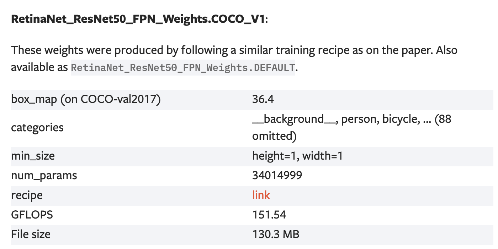
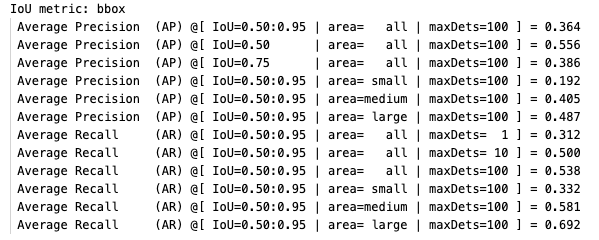
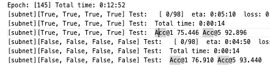
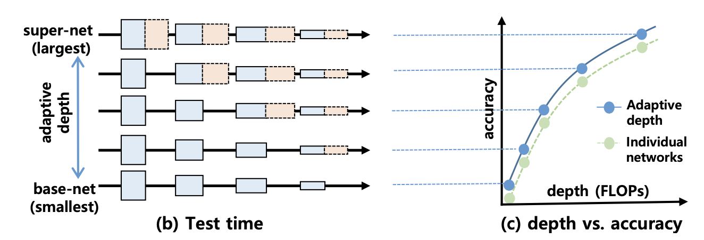
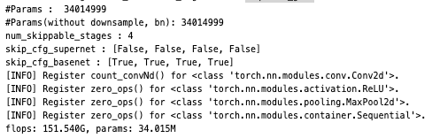
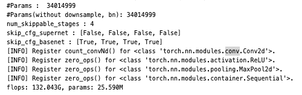
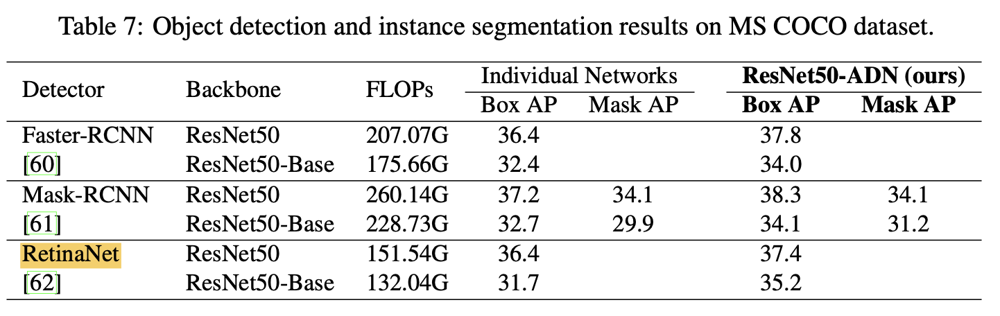

This is the official implementation of the paper "[Adaptive Depth Networks with Skippable Sub-Paths (NeurIPS 2024)](https://proceedings.neurips.cc/paper_files/paper/2024/file/3a2d96d2eb2902043c2db705ca03e9a2-Paper-Conference.pdf)" for the RetinaNet ADN experiment.

## Requirements

All experiments are conducted using identical hardware and software resources.

| | |
|---|---|
| **GPU** | NVIDIA GeForce RTX 4090 × 4 |
| **OS** | Ubuntu 22.04 |
| **Python** | 3.11.7 |
| **CUDA** | 12.1 |
| **PyTorch** | 2.2.1 |

## Description of the Project

The key papers that have influenced the topic selection are as follows.

- [He, Kaiming, et al. "Deep residual learning for image recognition." Proceedings of the IEEE conference on computer vision and pattern recognition. 2016.](https://arxiv.org/abs/1512.03385)
- [Lin, Tsung-Yi, et al. "Feature pyramid networks for object detection." Proceedings of the IEEE conference on computer vision and pattern recognition. 2017.](https://arxiv.org/abs/1612.03144)
- [Lin, Tsung-Yi, et al. "Focal loss for dense object detection." Proceedings of the IEEE international conference on computer vision. 2017.](https://arxiv.org/abs/1708.02002)
- [Kang, Woochul. "Adaptive Depth Networks with Skippable Sub-Paths." arXiv preprint arXiv:2312.16392 (2023).](https://arxiv.org/abs/2312.16392)

### `01_PyTorch_RetinaNet/`

RetinaNet is used as the base detector for its accessibility for research and development, since [PyTorch provides a reference implementation of RetinaNet for research purposes](https://github.com/pytorch/vision/blob/main/torchvision/models/detection/retinanet.py), which makes code management straightforward.

**[PyTorch reference model mAP](https://pytorch.org/vision/main/models/generated/torchvision.models.detection.retinanet_resnet50_fpn.html#torchvision.models.detection.retinanet_resnet50_fpn): 0.364 (MS COCO)**



```python
# reference recipe
torchrun --nproc_per_node=8 train.py \
    --dataset coco --model retinanet_resnet50_fpn --epochs 26 \
    --lr-steps 16 22 --aspect-ratio-group-factor 3 --lr 0.01 \
    --weights-backbone ResNet50_Weights.IMAGENET1K_V1
```



### `02_AdaptiveDepthNetwork/`

The performance of applying an adaptive depth network to the RetinaNet backbone (ResNet50-FPN) is evaluated here.

**Scope of work:**

- Train the backbone network (ResNet50-FPN) using skip-aware self-distillation.
- Implement switchable batch normalization.
- Add a `skip` argument to the forward function used at evaluation time.
- Modify the FPN lateral path to correctly handle the skipped network.

**ResNet50-ADN training result (`model_145.pth`):**

| Model | Acc@1 | Acc@5 | FLOPs |
|---|---|---|---|
| ResNet50-ADN (super-net: `[False] * 4`) | 76.910% | 93.440% | 4.11G |
| ResNet50-ADN (base-net: `[True] * 4`) | 75.446% | 92.896% | 2.58G |



### `03_1_RetinaNet_with_ResNet50-ADN_backbone/`

The RetinaNet backbone from `01_PyTorch_RetinaNet/` is replaced with the ResNet50-ADN backbone from `02_AdaptiveDepthNetwork/`. The baseline is initialized from the `ResNet50_Weights.IMAGENET1K_V1` weights provided by PyTorch. The **super** model refers to the PyTorch reference RetinaNet model, and the **base** model refers to the variant that skips the residual blocks of ResNet50.



**Summary of results.** Retraining the super/base paths jointly with self-distillation and **foreground-aware feature selection** (see below) improves both paths over their respective baselines, using a single trained model whose accuracy/compute trade-off is controlled solely by the `skip` flag:

| Path | Baseline mAP | Retrained mAP | Δ |
|---|---|---|---|
| Super-net (full path) | 0.364 | **0.374** | +0.010 |
| Base-net (residual blocks skipped) | 0.317 | **0.352** | +0.035 |

| Path | GFLOPs |
|---|---|
| Super-net | 151.54 |
| Base-net | 132.04 (**−12.9%**) |

**Baseline results:**

| Schedule | Super | Base |
|---|---|---|
| PyTorch schedule | 0.364 | [0.317](https://github.com/LeeHyungSeop/RetinaNet-ADN/blob/main/03_2_base-model-baseline/logs/base_model_pytorch_baseline_torchWeight.txt) |
| mmdetection schedule | 0.357 | [0.304](https://github.com/LeeHyungSeop/RetinaNet-ADN/blob/main/03_2_base-model-baseline/logs/base_model_mmdetection_baseline_torchWeight.txt) |

#### Anchor Index Ranges per FPN Level

Foreground/background anchor indices are distributed across the FPN pyramid levels as follows (190,323 anchors in total):

| FPN level | Anchor index range |
|---|---|
| P3 | 0 – 136,799 |
| P4 | 136,800 – 170,999 |
| P5 | 171,001 – 179,549 |
| P6 | 179,550 – 188,099 |
| P7 | 188,100 – 190,322 |

**Intermediate feature selection for distillation.** Naively distilling every intermediate feature between the super and base paths includes a large number of background-anchor locations that carry little useful supervisory signal and can destabilize training. To address this, the anchor indices generated by each path are analyzed per FPN level (see the anchor index table above), and the intermediate features passed to the distillation loss are selected accordingly. This **foreground-aware feature selection** is evaluated under three variants:

- **exp1 — foreground-aware selection**: Distill only the intermediate features whose anchors are predominantly foreground, so the distillation signal is concentrated where it matters most.
- **exp2 — background-exclusion selection**: Exclude the intermediate features whose anchors are predominantly background, then distill the rest.
- **exp3 — coarse-level exclusion**: Exclude P3 entirely and distill only P4–P7, since the majority of foreground anchors fall within P5–P7.

Across both the mmdetection and PyTorch schedules, **exp1 (foreground-aware selection) with α = 0.5 and no β weighting consistently achieved the best and most stable results**, while exp2 (background exclusion) was prone to divergence (`nan`) under several configurations. This indicates that concentrating the distillation loss on foreground-anchor-producing features is more effective and more stable than either excluding background features outright or applying purely output-level distillation without intermediate supervision.

```python
real_loss_super, intermedia_features_super, foreground_idxs = model(images, targets, skip=[False, False, False, False])
real_loss_base, intermedia_features_base, foreground_idxs = model(images, targets, skip=[True, True, True, True])

alpha = 0.5  # 0.7, 0.9
beta = 0.9

intermedia_features_super = exp1_exp2_exp3_algorithm(intermedia_features_super, foreground_idx_list)
intermedia_features_base = exp1_exp2_exp3_algorithm(intermedia_features_base, foreground_idxs)
kd_loss = criterion_kd(intermedia_features_base, intermedia_features_super)

# option 1 (with beta):    loss_base = beta * real_loss_base + (1 - beta) * kd_loss
# option 2 (without beta): loss_base = real_loss_base + kd_loss

final_loss = alpha * real_loss_super + (1 - alpha) * loss_base
final_loss.backward()
```

**Experiment results — mmdetection schedule (13 epochs, lr-steps 8, 11):**

| α | β | exp1 | exp2 | exp3 |
|---|---|---|---|---|
| 0.9 | – | | | (0.364, 0.328) |
| 0.9 | 0.9 | (0.363, 0.324) | (0.364, 0.326) | (0.366, 0.327) |
| 0.7 | – | | nan | (0.367, 0.338) |
| 0.7 | 0.9 | | | |
| 0.5 | – | **(0.367, 0.343)** | nan | (0.364, 0.340) |
| 0.5 | 0.9 | | | |

The `exp1_alpha05_nobeta` configuration, which performed best under the mmdetection schedule, was retrained using the PyTorch schedule ([training log](https://github.com/LeeHyungSeop/RetinaNet-ADN/blob/main/03_1_RetinaNet_with_ResNet50-ADN_backbone/logs/exp1_goodF_alpha05_noBeta_model_23_test.txt)):

**Experiment results — PyTorch schedule (26 epochs, lr-steps 16, 22):**

| α | β | exp1 | exp2 | exp3 |
|---|---|---|---|---|
| 0.9 | – | | | |
| 0.9 | 0.9 | | | |
| 0.7 | – | | | |
| 0.7 | 0.9 | | | |
| 0.5 | – | **(0.374, 0.352)** | | |
| 0.5 | 0.9 | | | |

**Computational cost** (measured with [pytorch-OpCounter](https://github.com/Lyken17/pytorch-OpCounter?tab=readme-ov-file)):

- Super model: 151.54 GFLOPs

  

- Base model: 132.043 GFLOPs

  

**Final result:**


